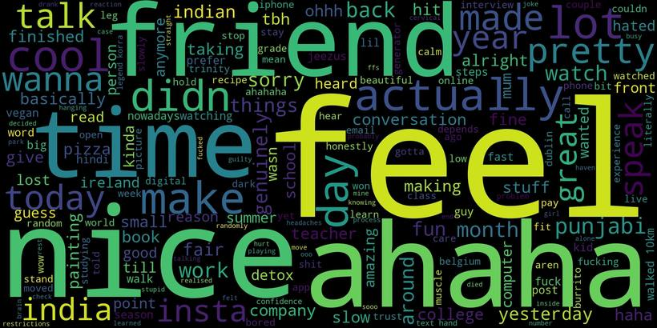
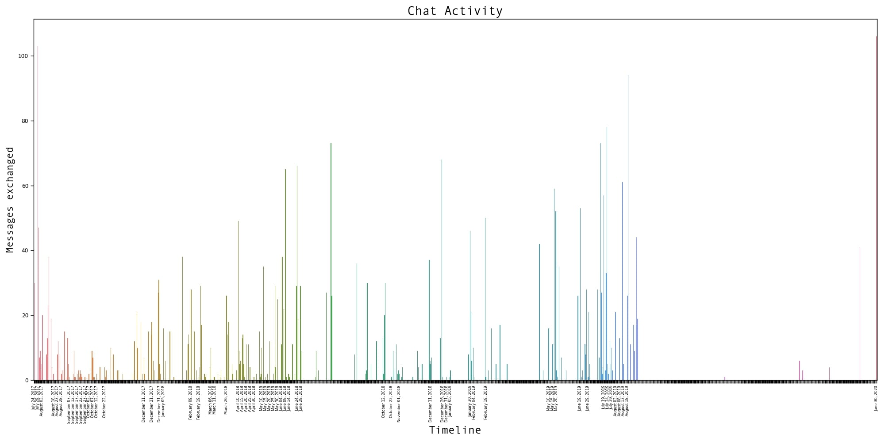
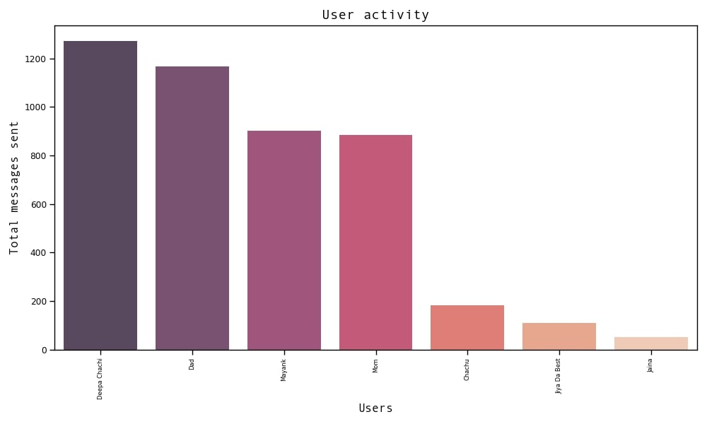
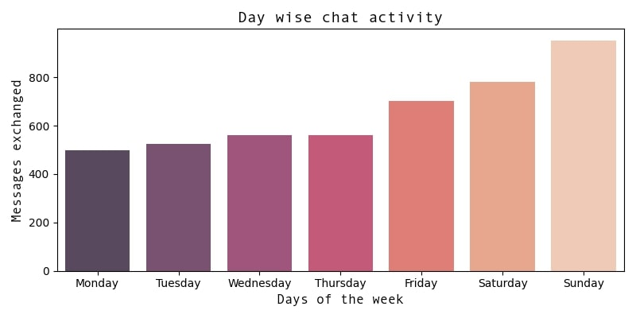

# Whatsapp chat analysis

## Getting Started

Download this project as a zip folder (green button with 'Code') or if you have git installed\
`git clone https://github.com/hotshot07/whatsapp_analyser.git` 

## Creating a virtual environment

A virtual environment is *like* a safe space where you can install your project dependencies without messing up the global modules.

To create a virtual environment, open terminal and `cd` into it.   
For example if whatsapp_analyser is saved on desktop 
`cd Desktop/whatsapp_analyser`   
(Press tab for autocompletion)  

To create a virtual environment named whatsapp,     
`python3 -m venv whatsapp`  

To activate the virtual enviroment, type in
`source whatsapp/bin/activate`  

If you see a (whatsapp) in front of your terminal screen, the virtual environment is now activated

## Installing dependencies

`pip3 install -r requirements.txt`

## Getting Data   
Create a new folder named 'data' to keep the directory clean.  
Export the data from your whatsapp chat and put the .txt file in it. 
Rename the .txt file to something without spaces like 'chat.txt'

## Starting the script
There is a different parser for iOS and Android. If you are exporting your chat from an iOS phone and the name of .txt file is 'chat.txt' type in   
`python3 main.py ios data/chat.txt`

If you are exporting from android,  
`python3 main.py android data/chat.txt`

## Outputs
A new folder 'userdata' is created and a .csv file named chat.csv is generated for the data you provided   

A new folder 'output' is created and it has all the images produced by the script   

The four images are
1. timeline.png (Your chat activity form the first day)
2. wordcloud.png (A high resolution wordcloud based on your chats)
3. user_activity.png (Total number of messages sent by each user)
4. week_vis.png (chat activity day wise)

  
   

 

## Issues  
 
This analyser has been tested on whatsapp chats from iPhone 11 running iOS 13.5.1   
It works fine for both individual and group chats.  

In some cases, especially for android, the date parser might not be able to parse properly as different devices export whatsapp chat differently. In line 13 of android_parser.py, you'll see the regex of the date. Try to compare it to your .txt file and change it if you get an issue. If it persists, raise an issue on github and I'll try to fix it ASAP. 

## Contributing

Feel free to contribute and send any pull requests!  

 

